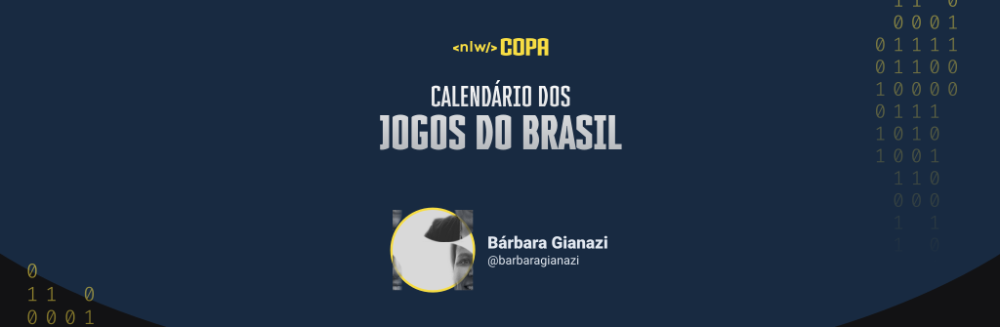
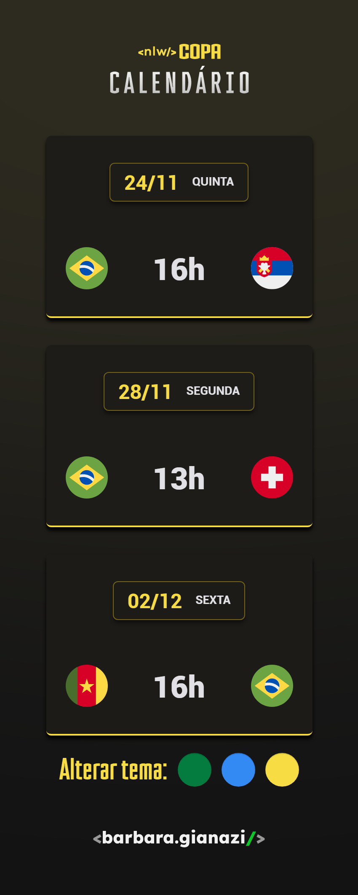
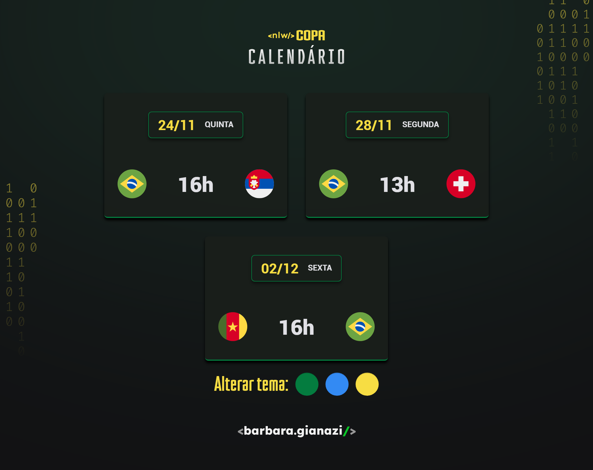
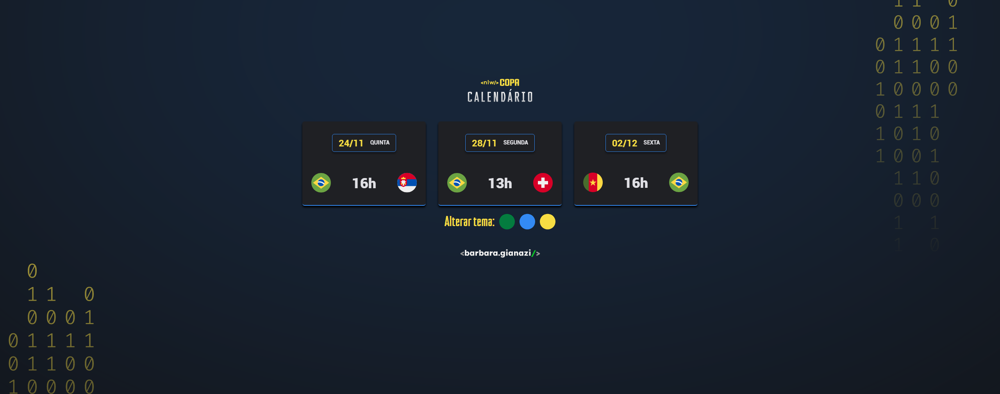

<h3 align="center"> 🚀 NLW Copa - Rocketseat </h3>

Evento gratuito em sua 10ª edição, promovido pela Rocketseat para ensino de tecnologias WEB, desta vez abordando o tema Copa do Mundo.

O Next Level Week é um evento totalmente online, gratuito e mão na massa promovido pela Rocketseat com muito código, desafios, networking e um único objetivo: te levar para o próximo nível, seja qual for o seu momento de carreira.

<h3 align="center">🖥️ Tecnologias</h3>

    
    
    
     
    
    
    

<h3 align="center">🥇 Placares atualizados!</h3>

<h4 align="center">8️⃣ Projeto atualizado em 05 de dezembro, após o Brasil se classificar para as oitavas de final!</h4>

<h3 align="center">🖼️ Imagens do projeto</h3>

<h4 align="center">Vídeo ilustrativo das alterações de temas :arrow_down:</h4>

<video width="320" height="240" controls >
  <source src="./assets/prints/video.mp4" type="video/mp4">
</video>

<h4>:yellow_circle: Print da versão mobile no tema amarelo :arrow_down:</h4>

<h4>:green_circle: Print da versão desktop no tema verde :arrow_down:</h4>

<h4>:large_blue_circle: Print da versão widescreen no tema azul :arrow_down:</h4>

<h1 style="color: #996dff; font-weight:bold">#neverstoplearning</h1>

